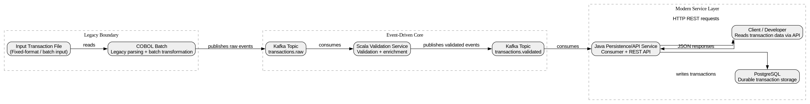

# Architecture

## Purpose

This project simulates the modernization of a legacy batch transaction processing system.

A COBOL batch component produces transaction files, which are published to Kafka and processed by modern services written in Scala and Java. The goal is to demonstrate how a legacy system can coexist with event-driven and service-oriented components, and to introduce myself to real world constraints.

## Components

### COBOL Batch
Responsible for reading input transaction data, applying legacy-style batch processing rules, and producing an output file.

### Kafka Broker
Responsible for transporting transaction events between producers and consumers. Kafka does not contain business rules.

### Scala Validation Service
Responsible for consuming raw transactions, validating them, and optionally enriching them before republishing.

### Java Persistence/API Service
Responsible for storing validated transactions in the relational database and exposing them through a REST API.

### Database
Responsible for durable storage of processed transaction records.

### Phoenix 
Responsible for building realtime user and intragration live data consumption.

## Responsibility Boundaries

- COBOL handles legacy-style batch parsing and transformation.
- Kafka handles event transport only.
- Scala handles validation and enrichment.
- Java handles persistence and REST API exposure.
- PostgreSQL handles durable storage.
- Phoenix handles user-facing realtime visualization only.

## System Diagram 

## Technology Choices

- **COBOL**: Represents the legacy batch core.
- **Kafka**: Decouples producers and consumers.
- **Scala**: Suitable for stream/event processing and typed validation logic.
- **Java / Spring Boot**: Widely used for persistence and REST APIs.
- **PostgreSQL**: Simple, reliable relational storage.
- **Elixir / Phoenix**: Suitable for realtime data consuming and display.

## Assumptions and Constraints

- This is a demonstration project, not a production banking platform.
- Transaction volumes are intentionally low.
- Security and authentication are out of scope for the first milestone.
- Event schemas are initially versioned manually.
- The system prioritizes architectural clarity over production-hardening.

## Phase 0 Freeze Decision

- Component set is fixed: COBOL, Kafka, Scala service, Java service, PostgreSQL and Phoenix.
- Primary event flow: batch -> Kafka -> validation -> persistence is fixed
- Database writes are performed only by the Java service.
- Phoenix is a presentation-layer component and does not perform validation or persistence.

## Future Evolution

Possible future enhancements:
- schema registry and Avro serialization.
- monitoring/observability stack.
- replay and dead-letter topic handling.
- Credit / Insurance subsystem.
